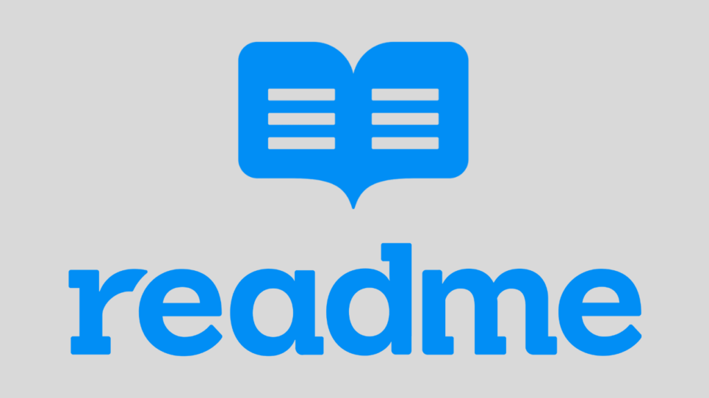

<p width="100%" align="center">
    
</p>

# Documentação README 

<p id="descrição" align="justify">
Este repositório apresenta um README padronizado.
Você irá ver utilização de imagens com html e markdown.

Iremos apresentar menu como tabela de conteúdo, tecnologias, badges entre outros.
</p>

[](https://github.com/)
[](https://github.com)
[](https://www.typescriptlang.org/)


## Menu

<ul>
    <li>
        <a href="#descrição">Descrição</a>
    </li>
    <li>
        <a href="#status">Status do Projeto</a>
    </li>
    <li>
        <a href="#features">Features</a>
    </li>
    <li>
        <a href="#mapa">Mapa do Projeto</a>
    </li>
</ul>

## :rocket: Status do Projeto
<p id="status">
    ...Em construção
</p>

<p id="features"></p>

## Features 
- [x] Badges
- [x] Status
- [x] Mapa do Prejeto


<p id="mapa"></p>

## Mapa do Projeto

```.
├───img
└───temp
```

